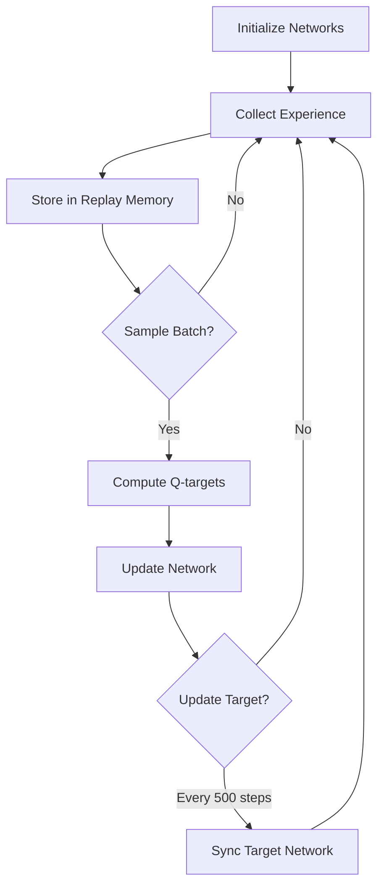

# DQN Self-Driving Car Simulation
*Deep Q-Network powered self-driving car navigating a complex environment*

## Overview
This project implements a self-driving car simulation using Deep Q-Networks (DQN), a cutting-edge reinforcement learning algorithm. The car learns to navigate environments by processing sensor data through a neural network that predicts optimal driving actions. Unlike traditional programming, the car learns through trial-and-error experiences, mimicking how humans develop driving skills.

## Key Features
- 🧠 **Deep Q-Learning** - Neural network-based decision making
- 🔄 **Experience Replay** - Learns from 100,000+ stored experiences
- � **Double DQN Architecture** - Stable learning with dual networks
- 📈 **Adaptive Exploration** - Balances learning vs execution
- 💾 **Model Checkpointing** - Automatic saving of best models
- 📊 **Performance Tracking** - Real-time reward monitoring

## Understanding DQN as Reinforcement Learning
DQN combines Q-Learning with deep neural networks to handle complex environments:

### Core Concepts
1. **Markov Decision Process**:
   - **State**: Car's sensor readings
   - **Action**: Steering decisions (left/right/straight)
   - **Reward**: Feedback for good/bad decisions
   - **Policy**: Neural network mapping states to actions

2. **Q-Learning Fundamentals**:
   ```python
   Q(s,a) = Q(s,a) + α[r + γ·max(Q(s',a')) - Q(s,a)]
   ```
   Where:
   - `α` = Learning rate (how quickly to update)
   - `γ` = Discount factor (future reward importance)

3. **Experience Replay**:
   - Stores transitions `(state, action, reward, next_state)`
   - Samples random batches for stable learning

4. **Target Network**:
   - Separate network updated periodically
   - Prevents chasing moving targets

### Why DQN Works for Self-Driving Cars
- Handles high-dimensional sensor data
- Learns complex driving policies through experience
- Balances exploration (trying new actions) vs exploitation (using known good actions)
- Adapts to dynamic environments through continuous learning

## Physics and Mathematics

### Car Movement Dynamics
```python
# Position update
x = x + velocity * cos(angle) * delta_time
y = y - velocity * sin(angle) * delta_time  # PyGame coordinate system

# Rotation handling
angle += rotation_velocity * steering_direction
```

### Sensor System
Cars use 5 radar sensors at angles: -90°, -45°, 0°, 45°, 90°:
```python
sensor_angles = [-90, -45, 0, 45, 90]
distances = [self.get_distance(angle) for angle in sensor_angles]
```

### Collision Detection
```python
if track_mask.get_at((int(car_x), int(car_y))) == BORDER_COLOR:
    reward = -10
    done = True
```

### Reward System
- `+1` for each frame staying on track
- `+5` for reaching checkpoint
- `-10` for collision
- `-2` for going off-road

## Neural Network Architecture
```
Input Layer (5 sensor values + speed)
       ↓
Fully Connected Layer (128 neurons, ReLU)
       ↓
Fully Connected Layer (64 neurons, ReLU)
       ↓
Output Layer (Q-values for 3 actions: left/right/straight)
```

### Exploration Strategy
```python
epsilon = max(0.05, 0.5 * (0.995 ** (steps // 200)))
if random() < epsilon:
    return random_action()
else:
    return best_q_value_action()
```

## Installation
1. **Clone repository**:
   ```bash
   git clone https://github.com/marasinibishesh/self-driving-car-DQN.git
   cd self-driving-car-DQN
   ```

2. **Install dependencies**:
   ```bash
   pip install torch numpy pygame
   ```

## Requirements
- Python 3.8+
- PyTorch
- NumPy
- PyGame
- Matplotlib (for visualization)

## Usage
**Start training**:
```bash
python main.py --mode train
```

**Test pre-trained model**:
```bash
python main.py --mode test --model models/best_model.pth
```

**Simulation controls**:
- `ESC`: Exit simulation
- `SPACE`: Pause/resume
- `R`: Reset environment

## Training Process
The DQN reinforcement learning cycle:


### Key Parameters
| Parameter | Value | Description |
|-----------|-------|-------------|
| Memory Size | 100,000 | Experience replay capacity |
| Batch Size | 128 | Training samples per batch |
| Gamma | 0.99 | Future reward discount |
| Target Update | 500 steps | Target network sync frequency |
| Learning Rate | 0.0001 | Optimization step size |

## File Structure
```
self-driving-car-dqn/
├── main.py             # Main simulation environment
├── agent.py            # DQN implementation
├── models/             # Saved model checkpoints
├── tracks/             # Race track images
├── requirements.txt    # Dependencies
└── README.md           # Documentation
```

## Customization
1. **Add new tracks**:
   - Create PNG images in `tracks/` folder

2. **Modify physics**:
   ```python
   CAR_MAX_SPEED = 8
   ROTATION_VEL = 3
   ACCELERATION = 0.1
   ```

3. **Adjust rewards**:
   ```python
   # agent.py
   REWARD_ON_TRACK = 1
   REWARD_CHECKPOINT = 5
   PENALTY_COLLISION = -10
   ```

## Results Interpretation
1. **Reward Window**:
   - Average reward over last 1000 steps
   - Indicator of learning progress
   
2. **Training Metrics**:
   - Collision frequency (should decrease)
   - Average speed (should increase)
   - Distance traveled (should increase)

3. **Success Criteria**:
   - Complete track without collisions
   - Maintain average speed > 5 units/sec
   - Achieve reward > 500 in 1000 steps

## Troubleshooting
| Issue | Solution |
|-------|----------|
| Low rewards | Increase exploration rate |
| Collisions persist | Adjust reward penalties |
| Slow learning | Increase batch size |
| Unstable training | Reduce learning rate |
| GPU not utilized | Install CUDA-compatible PyTorch |

## Future Enhancements
1. [ ] Prioritized Experience Replay
2. [ ] Dueling DQN Architecture
3. [ ] Multi-agent training
4. [ ] Dynamic obstacles and traffic
5. [ ] Vision-based input (CNN)
6. [ ] Real-world vehicle integration

## Acknowledgments
- DeepMind for pioneering DQN research
- PyTorch development team
- Reinforcement learning research community
- OpenAI Gym for inspiration

## References
1. Mnih, V. et al. (2015). "Human-level control through deep reinforcement learning". Nature.
2. Sutton, R. S. & Barto, A. G. (2018). "Reinforcement Learning: An Introduction".
3. Van Hasselt, H. et al. (2016). "Deep Reinforcement Learning with Double Q-Learning".

## Contributing
Contributions are welcome! Please follow these steps:
1. Fork the repository
2. Create a feature branch (git checkout -b feature/improvement)
3. Commit your changes (git commit -am 'Add some feature')
4. Push to the branch (git push origin feature/improvement)
5. Open a pull request

## License
MIT License

---
